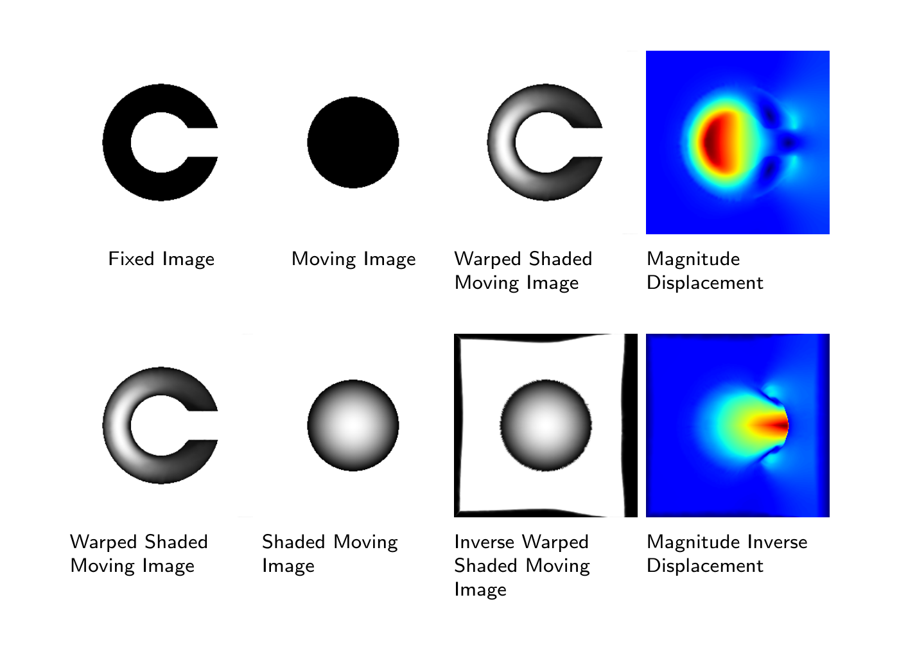

## AirLab - MICCAI Tutorial 2019

Date: October 17, 2019 (afternoon)

> **Joining Mailing List**
> Join the AirLab tutorial mailing list to keep up to date. Just send an e-mail to <airlab-dbe@unibas.ch> with the subject *JOIN MAILING LIST*

# Autograd Image Registration Laboratory

A myriad of medical image analysis tasks rely on image registration as a "preprocessing" on which the target model builds on. The development and implementation of such image registration algorithms have been tedious so far and often requires specific programming skills such as parallel computing with CUDA at a low abstraction level.
In this tutorial, the novel image registration framework: Autograd Image Registration Laboratory (AirLab) will be introduced. AirLab is a modern framework for image registration which allows rapid-prototyping for image registration algorithms. It is written in Python and utilizes the autograd functionality of PyTorch in order to exempt the developer from providing explicit gradients. The hands-on tutorial will be for beginners and intermediate-level students, experienced researchers and industry delegates. Participants will learn the principles of AirLab, how AirLab can be integrated into a project and how AirLab can be used in their daily research.

GitHub: [https://github.com/airlab-unibas/airlab](https://github.com/airlab-unibas/airlab)

# Program

## Session 1 (14:00):

### Introduction to Medical Image Registration
* Basic concepts and applications
* Novel learning-based concepts

### Applied Image Registration 
* Main issues with development and implementation
* Current image registration frameworks and tools
* Primer on PyTorch with basic examples

### Introduction to AirLab
* Basic concept behind AirLab
* Hello world example in AirLab
* Basic features for classic image registration

## Coffee Break (15:30)
* How to install AirLab
* Setting up software requirements and environment together

## Session 2 (16:30):

### Hello World with AirLab
* How to use AirLab
* How to extend AirLab and contribute to the project

### The Future of AirLab
* Discussion with participants about the future of AirLab
* AirLab for Learning-based Concepts (on-going)
* Feature requests

# Speakers

1. **Dr. Christoph Jud** Department of Biomedical Engineering, University of Basel, Switzerland
2. **Robin Sandkühler, M.Sc.** Department of Biomedical Engineering, University of Basel, Switzerland

# Organizers
Robin Sandkühler, Philippe C. Cattin, Christoph Jud

### Contact:
<airlab-dbe@unibas.ch>

# References
Robin Sandkuehler,  Christoph Jud, Simon Andermatt, and Philippe C. Cattin. "AirLab: Autograd Image Registration Laboratory". arXiv preprint arXiv:1806.09907, 2018. [link](https://arxiv.org/abs/1806.09907)

